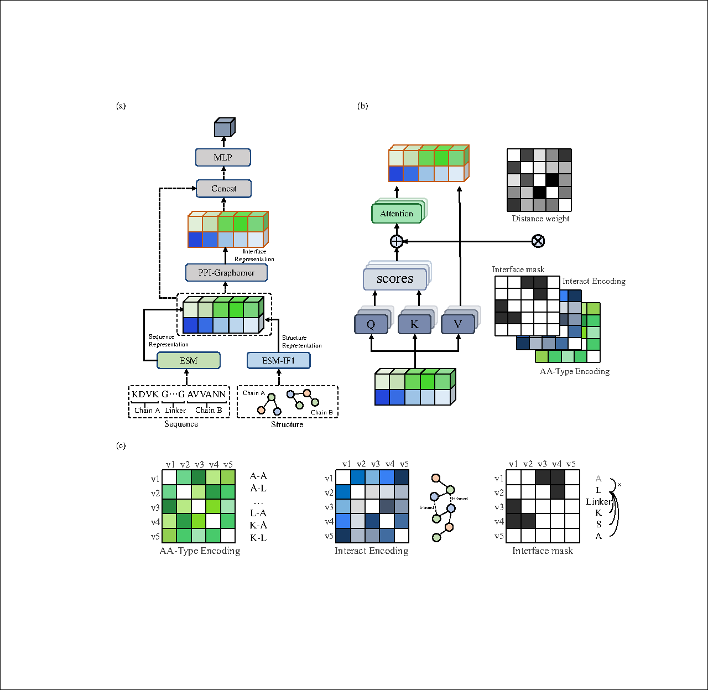

# PPI-Graphomer: Enhanced Protein-Protein Affinity Prediction Using Pretrained and Graph Transformer Models

## Overview
Protein-protein interactions (PPIs) are fundamental to understanding biological processes and have significant implications in drug research and development. The PPI-Graphomer project seeks to improve the prediction of protein binding affinities by integrating pretrained features from large-scale language models and inverse folding models, particularly focusing on the molecular interaction information at binding interfaces.

Our model, PPI-Graphomer, has been shown to outperform existing state-of-the-art methods on multiple benchmark datasets, demonstrating excellent generalization capabilities.

## Features
- Integrates pretrained features from ESM2 and ESM-IF1 models.
- Utilizes advanced graph-based edge definitions to enhance interface characterization.
- Employs the novel PPI-Graphomer module for modeling protein binding interactions.
## model architecture


## Performance
The model has achieved superior performance metrics:
- **5-fold Cross-Validation**: PCC of 0.581, MAE of 1.63.
- **Benchmark Comparison**: Achieved top rankings with a combined test set PCC of 0.633 and MAE of 1.57.

## Installation

Before you begin, ensure you have met the following requirements:
- Dependencies listed in `requirements.txt`

```bash
git clone https://github.com/xiebaoshu058/ppi-graphomer.git
cd ppi-graphomer
conda create -n ppi-graphomer python=3.9.18
conda activate ppi-graphomer
pip install -r requirements.txt
```
Since installing torch_scatter directly might lead to issues, I opted for a local installation method. 
You can download the package from [[link](https://data.pyg.org/whl/torch-2.1.0%2Bcu121/torch_scatter-2.1.2%2Bpt21cu121-cp39-cp39-linux_x86_64.whl)] and then execute "pip install torch_scatter-2.1.2+pt21cu121-cp39-cp39-linux_x86_64.whl" to install it.
Additionally, there may be some issues with the installed ESM library. You will need to navigate to the location of the downloaded library at your conda path (such as "/public/home/xiejun/miniconda3/envs/ppi_graphomer/lib/python3.9/site-packages/esm/inverse_folding"), and modify line 137 in util.py from batch = [(coords, None, seq)] to batch = [(coords, None, None)].

I have also prepared a compressed package of the environment I used[https://drive.google.com/file/d/1P34xuDxNu9WFvPK6JoKxqo3QWA2P_azm/view?usp=sharing]. If you are using a Linux platform with Miniconda3, you can download the file and extract it into your miniconda/envs directory.


## Usage
We provide two methods to run the script, single pdb or batch.

To predict single pdb, use the provided command-line interface:

```bash
python inference.py --pdb [path_to_pdb]
```
This script will output an affinity prediction value for the given PDB. For example: predict affinity: 9.022720336914062.

If you need to make batch predictions, you should follow these steps:

```bash
python preprocess_cpu.py --workers [cpu numbers] --save_dir [path_to_PreprocessedCpuData] --pdb_folder [path_to_pdbs]
python preprocess_gpu.py --workers [cpu numbers] --save_dir [path_to_PreprocessedGpuData] --pdb_folder [path_to_pdbs] --single_process [is_single_process]
```
These scripts will generate some pre-processed data, which will be stored in the 'preprocess' folder, such as "yourpath/PPI-Graphomer/data/preprocess/cpu/default/". When running preprocess_gpu.py on a personal computer with limited GPU memory, it needs to be modified to single-process mode; otherwise, the feature extraction will fail.
```bash
python data_check.py  --cpu_path [path_to_PreprocessedCpuData] -gpu_path [path_to_PreprocessedGpuData] --save_folder [path_to_CheckedData]
```
This script will check whether the previous outputs conform to the specifications. It will also display the number of samples, as well as the amino acid count of the longest and shortest samples.
```bash
python generate_batch.py  --data [path_to_CheckedData] -gpu_path [path_to_PreprocessedGpuData] --batch_path [path_to_BatchData]
```
This script will further organize the data.
For these pre-processed files, we have organized a final dataset for testing, which is available for download in the cloud[https://drive.google.com/file/d/1P34xuDxNu9WFvPK6JoKxqo3QWA2P_azm/view?usp=drive_link]. This data is derived from Test Set 1 mentioned in the paper.
```bash
python evaluate.py  --batch_path [path_to_BatchData]
```
This script will print the model and output the correlation coefficient between the predicted values and labels for the batch.


We have divided the whole step into several items in order to speed up the process by separating the esm large model prediction process from the affinity prediction process.

